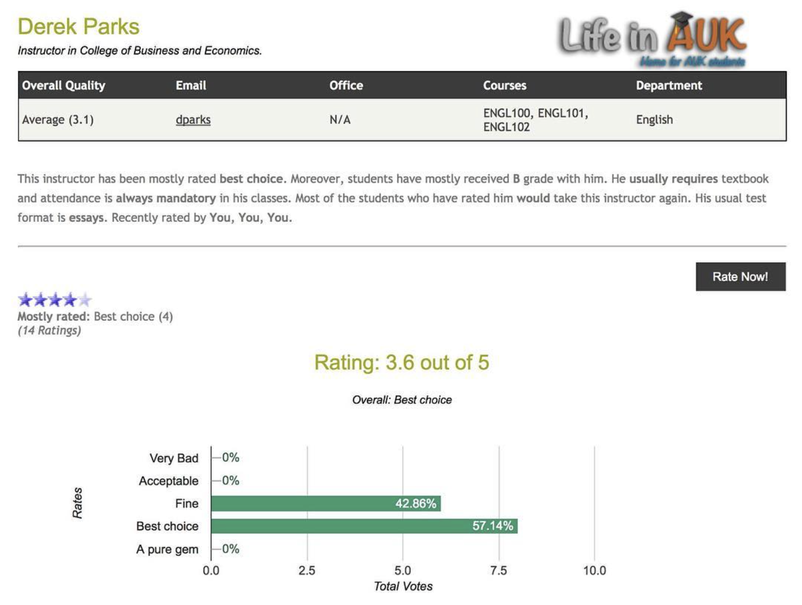
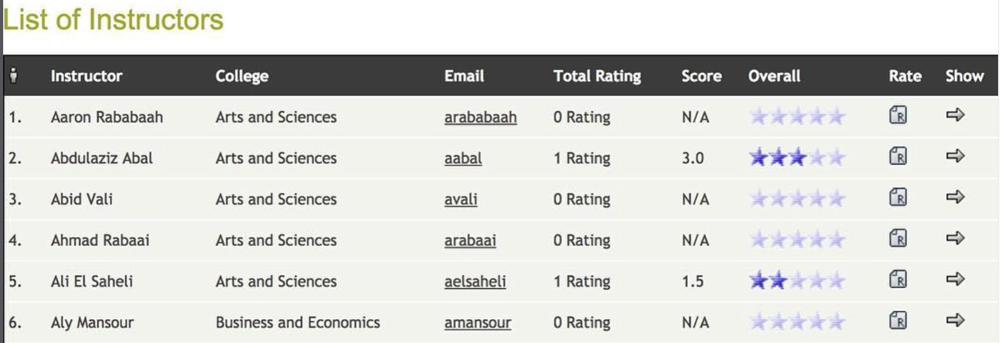

# Rate My Instructor

A PHP web app that lets students browse, search, and rate their instructors — think RateMyProfessors, self-hosted. Originally built in 2016–2017 as an add-on for an SMF (Simple Machines Forum) community site, since genericized here as a standalone script.

## Screenshots

| | |
|---|---|
|  |  |
|  |  |
|  | |

## Features

- Browse/search instructors by name, department, or college
- Rate instructors on multiple axes (overall rating, level of difficulty, "take again?", attendance, textbook use, etc.) plus free-text comments
- Tag-based quick reactions (thumbs up/down, etc.)
- "My Ratings" and "My Suggested Instructors" pages per logged-in user
- Suggest new instructors to be added, with admin review queue
- Simple admin center for managing instructors/tags/site settings (`rmi_script` config table)
- "Respect points" system that rewards users for rating instructors, gating some features (like suggesting new instructors) behind a minimum respect threshold

## How it works / requirements

This is a plain procedural PHP app (no framework, no Composer) built against the old `mysql_*` extension — it's a snapshot of mid-2010s PHP, not modern PHP. To actually run it today you'd want to port the DB layer to `mysqli`/PDO first.

It expects:
- **MySQL** with its own tables (`rmi_instructors`, `rmi_rate`, `rmi_tags`, `rmi_script`, `rmi_addinstructor`) — see [`db/schema.sql`](db/schema.sql)
- **An existing members/auth table** to check who's logged in — originally SMF's `smf_members` table (via SMF's `SSI.php` bootstrap for session/login state), but any users table with the columns the script reads (`id_member`, `member_name`, `real_name`, `passwd`, `email_address`, `karma_good`, `posts`) would work with a bit of adaptation

## Project structure

```
.
├── connect.php       DB connection + table name config (edit this first)
├── index.php         Main entry point / router (styled version)
├── default.php       Alternate/simpler entry point
├── pages/            One file per page (main, instructor, rate, search, myratings, admincenter, ...)
├── scripts/          Shared helpers (functions.php, navbar.php, chart loading, latest news)
├── style/            CSS + image assets
├── name/.htaccess    Rewrite rule for pretty instructor-name URLs
└── db/schema.sql      Schema-only SQL (app tables + expected members table shape)
```

## Setup

1. Import [`db/schema.sql`](db/schema.sql) into a MySQL database, and seed `rmi_script` with your own site title/branding (or edit the column defaults before importing).
2. Edit `connect.php`: DB credentials, and `$forum_url` / `$website_url` for your own domain.
3. Point `require(...)` in `index.php`/`default.php` at your own members/session bootstrap (originally SMF's `SSI.php`) instead of the placeholder path.
4. Serve the folder from your web server; instructor pages are routed via `?page=...` query params (see `index.php`).

## Notes

- The DB layer uses the long-removed `mysql_*` PHP functions — not compatible with PHP 7+. Treat this as a historical snapshot / reference implementation rather than something to deploy as-is.
- All real user/instructor data and the original site's identifying config values have been stripped out of this repo; only the code and table structure remain.
